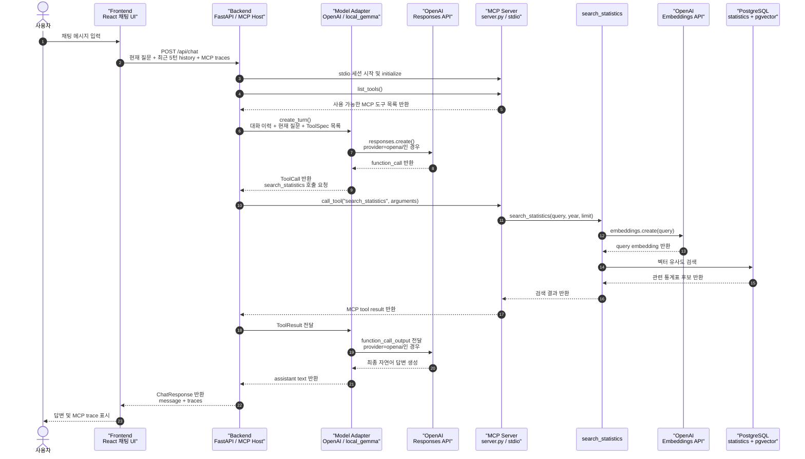

# 채팅 요청 처리 흐름

```mermaid
sequenceDiagram
    autonumber

    actor User as 사용자
    participant Frontend as "Frontend<br/>React 채팅 UI"
    participant Backend as "Backend<br/>FastAPI / MCP Host"
    participant Model as "Model Adapter<br/>OpenAI / local_gemma"
    participant OpenAI as "OpenAI<br/>Responses API"
    participant MCP as "MCP Server<br/>server.py / stdio"
    participant Tool as search_statistics
    participant Embed as "OpenAI<br/>Embeddings API"
    participant DB as "PostgreSQL<br/>statistics + pgvector"

    User->>Frontend: 채팅 메시지 입력
    Frontend->>Backend: POST /api/chat<br/>현재 질문 + 최근 5턴 history + MCP traces

    Backend->>MCP: stdio 세션 시작 및 initialize
    Backend->>MCP: list_tools()
    MCP-->>Backend: 사용 가능한 MCP 도구 목록 반환

    Backend->>Model: create_turn()<br/>대화 이력 + 현재 질문 + ToolSpec 목록
    Model->>OpenAI: responses.create()<br/>provider=openai인 경우
    OpenAI-->>Model: function_call 반환
    Model-->>Backend: ToolCall 반환<br/>search_statistics 호출 요청

    Backend->>MCP: call_tool("search_statistics", arguments)
    MCP->>Tool: search_statistics(query, year, limit)

    Tool->>Embed: embeddings.create(query)
    Embed-->>Tool: query embedding 반환

    Tool->>DB: 벡터 유사도 검색
    DB-->>Tool: 관련 통계표 후보 반환

    Tool-->>MCP: 검색 결과 반환
    MCP-->>Backend: MCP tool result 반환

    Backend->>Model: ToolResult 전달
    Model->>OpenAI: function_call_output 전달<br/>provider=openai인 경우
    OpenAI-->>Model: 최종 자연어 답변 생성
    Model-->>Backend: assistant text 반환

    Backend-->>Frontend: ChatResponse 반환<br/>message + traces
    Frontend-->>User: 답변 및 MCP trace 표시
```
